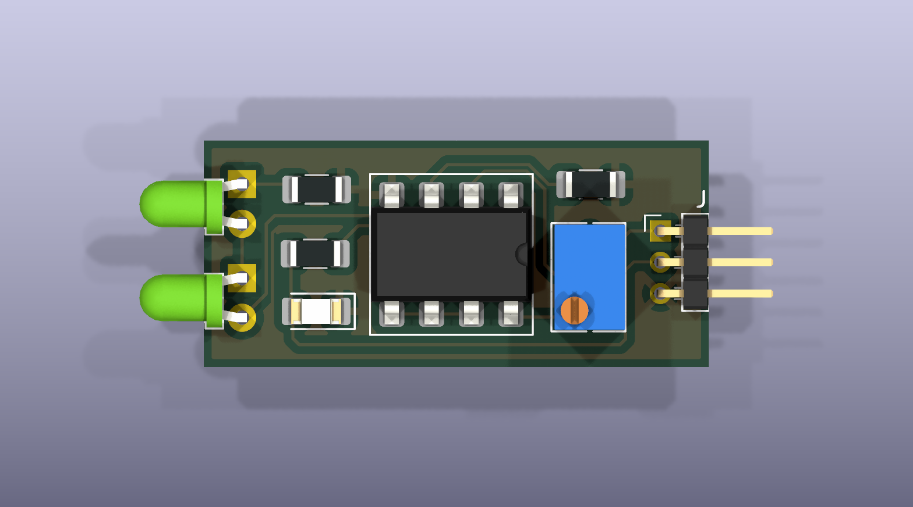
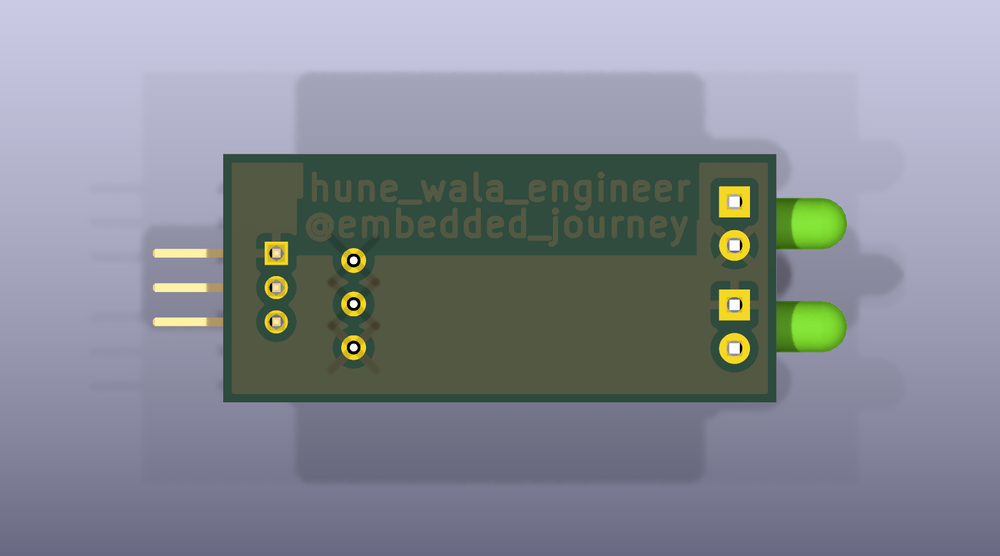
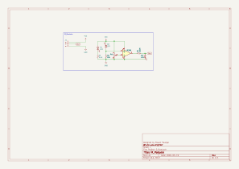

# IR Proximity / Obstacle-Detection Module

A compact **32.3 × 14.5 mm** two-layer IR reflective proximity sensor board, designed from scratch in **KiCad 9**. An IR LED illuminates the scene, a photodiode picks up the reflection, and an **LM358** wired as a comparator turns that analog level into a clean digital `OUT` signal with an adjustable trip point.

Built as a 2nd-semester PCB design project — schematic capture, footprint selection, layout, copper pours and fabrication output, all done by hand.

<p align="center">
  
  
</p>

---

## Table of Contents

- [Features](#features)
- [How It Works](#how-it-works)
- [Specifications](#specifications)
- [Schematic](#schematic)
- [Bill of Materials](#bill-of-materials)
- [Pinout](#pinout)
- [Using the Module](#using-the-module)
- [Calibration](#calibration)
- [PCB Design Notes](#pcb-design-notes)
- [Manufacturing](#manufacturing)
- [Design Review & Known Issues](#design-review--known-issues)
- [Roadmap (v2)](#roadmap-v2)
- [Repository Structure](#repository-structure)
- [Opening the Project](#opening-the-project)
- [What I Learned](#what-i-learned)
- [License](#license)

---

## Features

- **Reflective IR proximity detection** — no moving parts, no contact
- **Adjustable threshold** via an on-board multi-turn trimmer (Bourns 3266Y)
- **Digital output** — a single logic-level pin, no ADC required
- **On-board status LED** that mirrors the output state
- **Tiny footprint** — 32.3 × 14.5 mm, edge-facing LEDs so the board can sit flat behind a bezel
- **Single-supply** operation from 5 V, 3-pin 2.00 mm header
- **Mixed THT + SMD** build — hand-solderable 1206 passives, socketed DIP-8 op-amp
- Full **fabrication package** (Gerbers, drill, pick-and-place) included

---

## How It Works

The signal chain is four stages: emit, receive, compare, indicate.

| Stage | Parts | What happens |
| --- | --- | --- |
| **1. Emit** | `D1`, `R1` | IR LED runs continuously at ~35 mA |
| **2. Receive** | `D2`, `R2` | Reverse-biased photodiode + 10 kΩ load turns reflected light into a voltage |
| **3. Compare** | `U1A`, `RV1` | LM358 compares that voltage against a trimmer-set threshold |
| **4. Indicate** | `R3`, `D3`, `J1` | Status LED lights and `OUT` asserts |

**1 — Emit.** `D1` is a continuously-on IR LED. `R1` (100 Ω) sets the forward current to roughly **35–38 mA** at 5 V, a healthy drive level for a 940 nm emitter.

**2 — Receive.** `D2` is an IR photodiode wired in **reverse bias** — cathode to `VCC`, anode to `R2` down to ground. With no reflection it leaks only nanoamps and the anode node sits close to 0 V. When IR bounces off a nearby object, photocurrent through the 10 kΩ load pulls that node **upward**: more reflected light, higher voltage.

**3 — Compare.** `U1A` (one half of an LM358) runs open-loop as a comparator:

| Op-amp input | Connected to | Meaning |
| --- | --- | --- |
| `+` (pin 3) | photodiode / `R2` junction | live light level |
| `−` (pin 2) | `RV1` wiper | user-set threshold |

So the logic reduces to one sentence:

> **`OUT` goes HIGH when the reflected IR level rises above the threshold** — i.e. when an object is detected. `OUT` sits LOW when the path is clear.

**4 — Indicate.** `R3` (330 Ω) feeds the op-amp output to `D3`, a 1206 SMD status LED, and to the `OUT` pin of the header. The LED lights whenever detection is active, giving instant visual feedback while tuning the trimmer. *(See [Known Issues](#design-review--known-issues) — this shared node is the one thing I would rewire in v2.)*

### Net map

Every net on the board, straight from the layout:

| Net | Connects |
| --- | --- |
| `VCC` | `J1.1` · `D1` anode · `D2` cathode · `RV1.1` · `U1.8` · B.Cu pour |
| `GND` | `J1.3` · `R1.2` · `R2.2` · `RV1.3` · `D3` cathode · `U1.4` · F.Cu pour |
| `Net-(D1-K)` | `D1` cathode → `R1.1` (emitter current path) |
| `Net-(D2-A)` | `D2` anode → `R2.1` → `U1.3` (**the sense node**) |
| `Net-(U1A--)` | `RV1.2` wiper → `U1.2` (threshold) |
| `Net-(R3-Pad1)` | `U1.1` op-amp output → `R3.1` |
| `Out` | `R3.2` → `D3` anode → `J1.2` |

---

## Specifications

| Parameter | Value |
| --- | --- |
| Supply voltage | 5 V DC (the LM358 tolerates 3–32 V; resistor values are picked for 5 V) |
| Typical current draw | ~45 mA, dominated by the always-on IR emitter |
| Output type | Digital, active-**HIGH** on detection |
| Sensing method | Reflective IR, unmodulated (DC) |
| Threshold adjustment | 10 kΩ multi-turn trimmer, `RV1` |
| Board size | 32.27 × 14.50 mm |
| Board thickness | 1.6 mm |
| Layers | 2 — F.Cu signal + `GND` pour, B.Cu `VCC` pour |
| Track width / clearance | 0.2 mm / 0.2 mm |
| Vias | None — single-layer routing, planes stitched through THT pads |
| Smallest drill | 0.8 mm |
| Connector | 3-pin, 2.00 mm pitch, right-angle header |

---

## Schematic

📄 **[docs/schematic.pdf](docs/schematic.pdf)** · 🖼️ **[docs/schematic.svg](docs/schematic.svg)**

<p align="center">
  
</p>

---

## Bill of Materials

Machine-readable copy: **[docs/bom.csv](docs/bom.csv)**

| Ref | Qty | Value | Footprint | Notes |
| --- | --- | --- | --- | --- |
| `U1` | 1 | LM358 | DIP-8, SMD socket pads, 7.62 mm | Dual op-amp; only unit A is used |
| `D1` | 1 | IR LED, 940 nm | 3 mm THT, horizontal | Emitter |
| `D2` | 1 | IR photodiode, 940 nm | 3 mm THT, horizontal | Receiver, reverse-biased |
| `D3` | 1 | LED | 1206 SMD | Detection status indicator |
| `R1` | 1 | 100 Ω | 1206 SMD | IR emitter current limit |
| `R2` | 1 | 10 kΩ | 1206 SMD | Photodiode load resistor |
| `R3` | 1 | 330 Ω | 1206 SMD | Status-LED current limit |
| `RV1` | 1 | 10 kΩ trimmer | Bourns 3266Y, vertical THT | Threshold set |
| `J1` | 1 | 1×3 header | 2.00 mm pitch, right-angle | VCC / OUT / GND |

> **Build tip:** `D1` and `D2` share the generic KiCad `LED` symbol because the emitter and detector come in the same 3 mm package. Fit the **emitter** (usually clear or blue-tinted) at `D1` and the **detector** (usually dark or black-tinted) at `D2` — swapping them silently kills the sensor.

---

## Pinout

`J1`, 2.00 mm right-angle header, viewed from the connector edge:

| Pin | Name | Direction | Description |
| --- | --- | --- | --- |
| 1 | `VCC` | in | 5 V supply |
| 2 | `OUT` | out | Digital detection signal — **HIGH = object detected** |
| 3 | `GND` | — | Ground |

---

## Using the Module

Wire `VCC` to 5 V, `GND` to ground, and `OUT` to any digital input pin.

```cpp
// IR proximity module — Arduino example
// OUT is active-HIGH: it rises when an object is detected.

const uint8_t IR_OUT_PIN = 2;

void setup() {
  pinMode(IR_OUT_PIN, INPUT);
  Serial.begin(9600);
}

void loop() {
  bool objectDetected = digitalRead(IR_OUT_PIN);
  Serial.println(objectDetected ? "Object detected" : "Clear");
  delay(100);
}
```

Because `OUT` is a plain level rather than a pulse train, it also works as an interrupt source for edge-triggered counting — line following, wheel encoders, object counters and end-stop detection are all straightforward uses.

> ⚠️ On a 5 V Arduino, read the [output-level note](#the-one-id-actually-fix-first) in Known Issues first — you may want the one-net rework described there for a reliable logic HIGH.

---

## Calibration

1. Power the board from a clean 5 V supply with **nothing in front of the sensor**.
2. Turn `RV1` until the status LED `D3` just switches **off**.
3. Place a target — a hand, or a sheet of white card — at the distance you want to trigger at.
4. Back the trimmer off slightly until `D3` switches **on** at that distance and stays off when the target is removed.
5. Re-check under the ambient lighting the module will actually live in. Sunlight and incandescent bulbs both emit strongly at 940 nm and will shift the trip point.

`RV1` is a **multi-turn** trimmer, so the adjustment is deliberately fine — expect several turns of travel.

---

## PCB Design Notes

- **Two-layer, single-sided routing.** All 76 track segments live on `F.Cu` at 0.2 mm. The design uses **zero vias**: the top layer carries a `GND` pour, the bottom a `VCC` pour, and both planes tie into the circuit through the plated through-holes of the header, the trimmer and the LEDs.
- **Edge-facing optics.** `D1` and `D2` use horizontal 3 mm LED footprints so both point straight out past the board edge. That keeps the assembly low-profile and lets the board mount flat behind a panel.
- **Optical separation.** Emitter and detector sit on the same edge about 6 mm apart, with the DIP-8 body and the rest of the circuitry behind them, reducing direct optical crosstalk from `D1` into `D2`.
- **Socketed op-amp.** `U1` uses a DIP-8 SMD-socket footprint, so the LM358 can be swapped without a soldering iron — handy when experimenting with faster comparators.
- **Hand-solderable choices.** 1206 passives with extended hand-solder pads, 2.00 mm header, no fine-pitch parts anywhere. This board can be reflowed *or* built at a bench.
- **Branding in copper.** The bottom `VCC` pour carries `hune_wala_engineer` / `@embedded_journey` as negative copper text rather than silkscreen — no extra process cost, and it will not rub off.

---

## Manufacturing

Ready-to-order outputs live in [`fab/`](fab/):

| File | Purpose |
| --- | --- |
| `IR_Module-gerbers.zip` | Upload directly to JLCPCB / PCBWay / OSHPark |
| `*.gtl` / `*.gbl` | Top / bottom copper |
| `*.gts` / `*.gbs` | Top / bottom solder mask |
| `*.gto` / `*.gbo` | Top / bottom silkscreen |
| `*.gtp` / `*.gbp` | Top / bottom paste, for stencils |
| `*.gm1` | Board outline (Edge.Cuts) |
| `Project-2.drl` | Excellon drill file |
| `Project-2-pos.csv` | Pick-and-place positions for assembly |

**Suggested fab settings:** 2 layers · 1.6 mm FR-4 · 1 oz copper · HASL or ENIG · any mask colour. Nothing on this board pushes past a standard low-cost process — minimum trace and space are 0.2 mm, and the smallest drill is 0.8 mm.

Regenerate every output from source with the KiCad CLI:

```bash
kicad-cli sch export pdf     --output docs/schematic.pdf Project-2.kicad_sch
kicad-cli sch export bom     --output docs/bom.csv       Project-2.kicad_sch
kicad-cli pcb render         --output docs/pcb-top.png --side top --quality high Project-2.kicad_pcb
kicad-cli pcb export gerbers --output fab/ --layers "F.Cu,B.Cu,F.Paste,B.Paste,F.SilkS,B.SilkS,F.Mask,B.Mask,Edge.Cuts" Project-2.kicad_pcb
kicad-cli pcb export drill   --output fab/ --format excellon Project-2.kicad_pcb
```

---

## Design Review & Known Issues

I ran DRC and ERC against the released files, and I would rather document what they found than quietly ship it. None of this stops the board from being fabricated or from working on the bench, but each item is a real lesson.

**DRC: 16 violations, 0 unconnected nets.**

| Finding | Count | Assessment |
| --- | --- | --- |
| `solder_mask_bridge` on `U1` pads 5–7 | 4 | Two netless copper straps tie the unused `U1B` pins together. Intentional, but drawn as no-net track instead of a real connection, so the shared mask opening gets flagged. **Fix:** make it a proper net in the schematic. |
| `silk_edge_clearance` on `J1` | 12 | The header's silkscreen outline runs past the board edge and gets clipped by the fab. Cosmetic only. **Fix:** trim the silk inside `Edge.Cuts`. |

**ERC: 46 violations.**

| Finding | Count | Assessment |
| --- | --- | --- |
| `endpoint_off_grid` | 42 | Wires drawn off the 1.27 mm grid. Schematic hygiene; connectivity is correct — DRC reports zero unconnected items. |
| `power_pin_not_driven` | 2 | No `PWR_FLAG` on `VCC` / `GND`. A KiCad convention, not a circuit fault. |
| `missing_unit` | 1 | `U1B`, the second op-amp, is never placed in the schematic. |
| `missing_input_pin` | 1 | Consequence of the above. |

### The one I'd actually fix first

**`OUT` is clamped by the status LED.** `R3` sits *between* the op-amp output and the `OUT` net, and `D3` hangs off `OUT` to ground. So the header's high level is not the op-amp's ~3.5 V swing — it is pinned near the LED's forward voltage, roughly **1.8–2.0 V**. A 3.3 V microcontroller reads that as HIGH; a **5 V Arduino (V<sub>IH</sub> ≈ 3.0 V) may not.**

> **Rework:** take `OUT` directly from `U1` pin 1, and hang `R3` + `D3` as a *branch* to ground off that same node — `pin 1 → R3 → D3 → GND`. One net change, and the output becomes a proper logic level while the indicator still works.

### Other honest limitations

- **No hysteresis.** The comparator runs open-loop, so a target hovering right at the threshold makes `OUT` chatter. A ~1 MΩ positive-feedback resistor from `U1` pin 1 back to pin 3 would give it clean snap-action.
- **No supply decoupling.** There is no 100 nF cap across the LM358's rails. The board survives on a bench supply, but that cap is the first part I would add.
- **Unmodulated IR.** The emitter is DC-driven, so ambient IR — sunlight, halogen lamps — shifts the trip point directly. Commercial modules drive the emitter at 38 kHz and demodulate, trading parts count for immunity.
- **High-impedance node routed across the board.** The `D2`/`R2` junction is the most noise-sensitive net in the design, and `R2` is placed near the trimmer rather than right next to `D2`, so that node travels further than it needs to.
- **LM358 as a comparator.** Cheap and it works, but its output cannot reach the positive rail and its response is in the microsecond range. Fine for proximity sensing, wrong for anything fast.

---

## Roadmap (v2)

- [ ] Tap `OUT` directly from the op-amp output; make `R3`/`D3` a branch
- [ ] Add a 100 nF decoupling cap across the LM358 supply
- [ ] Add positive-feedback hysteresis around the comparator
- [ ] Move `R2` next to `D2` to shorten the high-impedance sense net
- [ ] Tie unused `U1B` into a proper net — inputs to a rail, output to itself
- [ ] Clean up the schematic grid and add `PWR_FLAG`s so ERC comes back clean
- [ ] Bring the `J1` silkscreen fully inside the board outline
- [ ] Break the raw analog sense node out on a 4th pin, so a host MCU can read distance instead of just a threshold
- [ ] Explore a 38 kHz modulated variant for ambient-light immunity

---

## Repository Structure

```
IR_Module/
├── Project-2.kicad_pro       # KiCad project
├── Project-2.kicad_sch       # Schematic
├── Project-2.kicad_pcb       # PCB layout
├── docs/
│   ├── schematic.pdf         # Schematic, print-ready
│   ├── schematic.svg         # Schematic, web-viewable
│   ├── bom.csv               # Bill of materials
│   ├── pcb-top.png           # 3D render, top
│   └── pcb-bottom.png        # 3D render, bottom
├── fab/
│   ├── IR_Module-gerbers.zip # Complete fabrication package
│   ├── *.gtl, *.gbl, ...     # Gerbers
│   ├── Project-2.drl         # Drill file
│   └── Project-2-pos.csv     # Pick-and-place
├── .gitignore
├── LICENSE
└── README.md
```

---

## Opening the Project

1. Install **[KiCad 9.0](https://www.kicad.org/download/)** or newer — the files use the KiCad 9 format.
2. Clone the repo and open `Project-2.kicad_pro`.
3. Every symbol and footprint comes from the **standard KiCad libraries**. Nothing custom to install, nothing to relink.

---

## What I Learned

This was my first end-to-end board: analog front-end, comparator, layout, pours and fabrication output, without copying a reference design. The parts that actually taught me something:

- **Reading a sensor is the easy half.** Turning an analog level into a *trustworthy* digital decision is where hysteresis, thresholds and ambient rejection all live.
- **Layout is part of the circuit.** Routing a high-impedance photodiode node across a board is not a cosmetic choice — the placement *is* the noise spec.
- **Where you tap a signal matters.** The `OUT` / `R3` / `D3` mistake looks harmless on a schematic and only shows up when you put a scope on the header. Best lesson on the board.
- **DRC and ERC are feedback, not a grade.** Reading through all 62 findings and deciding which are real taught me more than a clean run would have.

---

## Author

**Pawan Paudyal** — [@hune_wala_engineer](https://instagram.com/hune_wala_engineer) · [@embedded_journey](https://instagram.com/embedded_journey)

Designed in KiCad 9 · 2026

## License

Released under the [MIT License](LICENSE). Build it, remix it, sell it — attribution appreciated.
