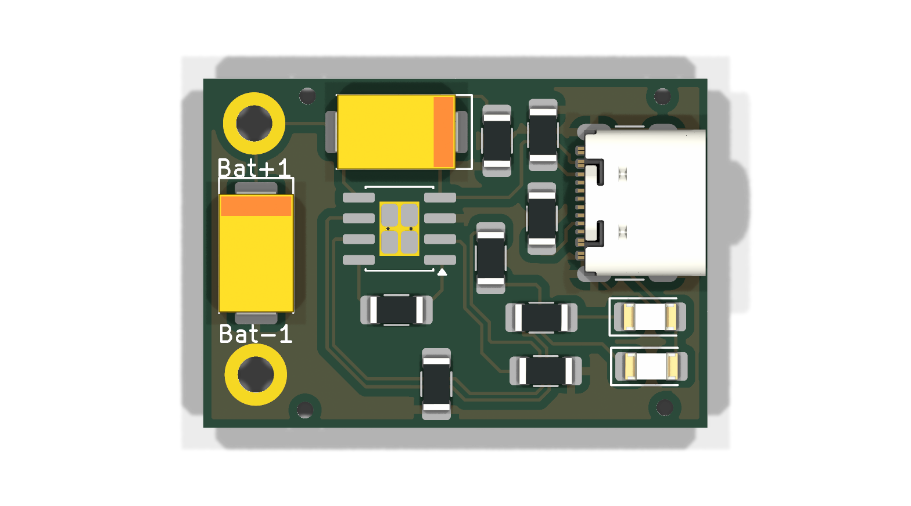
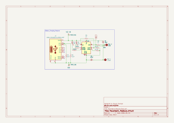

# USB-C Li-ion Charger Module (TP4056)

A compact **30.7 × 21.3 mm** two-layer USB-C lithium-ion charging board built around the **TP4056** linear charger, designed from scratch in **KiCad 9**. A USB-C receptacle with proper 5.1 kΩ CC pulldowns feeds a constant-current / constant-voltage charger that terminates at **4.2 V**, with two status LEDs and 2.2 mm solder pads for the cell.

Built as a 2nd-semester PCB design project — schematic capture, USB-C sink design, thermal-pad layout, ground pours and fabrication output, all done by hand.

<p align="center">
  
  
</p>

> ⚠️ **Read [Design Review & Known Issues](#design-review--known-issues) before you order this board.** The released files contain a routing break that leaves the `TEMP` pin floating, and the released `PROG` resistor programs the charger above its rated current. Both are documented, and both are one-line fixes — but they are real, and I would rather publish them than hide them.

---

## Table of Contents

- [Features](#features)
- [How It Works](#how-it-works)
- [Specifications](#specifications)
- [Schematic](#schematic)
- [Bill of Materials](#bill-of-materials)
- [Connections](#connections)
- [Using the Module](#using-the-module)
- [PCB Design Notes](#pcb-design-notes)
- [Manufacturing](#manufacturing)
- [Design Review & Known Issues](#design-review--known-issues)
- [Roadmap (v2)](#roadmap-v2)
- [Repository Structure](#repository-structure)
- [Opening the Project](#opening-the-project)
- [What I Learned](#what-i-learned)
- [Author](#author)
- [License](#license)

---

## Features

- **USB-C input** — 16-pin receptacle with `CC1` / `CC2` 5.1 kΩ pulldowns, so it enumerates as a proper sink and any USB-C source will actually turn on VBUS
- **TP4056 linear CC/CV charger** — 4.2 V ±1 % termination, no firmware, no tuning
- **Two status LEDs** — one for *charging*, one for *standby / done*
- **Solder-pad battery terminals** — 2.2 mm plated pads (`Bat+1` / `Bat-1`) take cell wires directly, no connector to source
- **Thermal-pad footprint** — SOIC-8-1EP with a 6-via thermal array under the package
- **All-SMD, hand-solderable** — 1206 passives, SOIC-8, no fine-pitch parts except the USB-C receptacle itself
- **Ground on both layers** — `F.Cu` and `B.Cu` are both `GND` pours
- Full **fabrication package** (Gerbers, drill, drill map, pick-and-place) included

---

## How It Works

The board is a single-chip charger. The chain is four stages: accept power, program the charge, charge the cell, report status.

| Stage | Parts | What happens |
| --- | --- | --- |
| **1. Accept** | `J3`, `R1`, `R2` | USB-C sink advertises itself; VBUS becomes `VCC +5V` |
| **2. Program** | `R7`, `R5`, `R6` | `PROG` sets charge current; `TEMP` / `CE` set the enable conditions |
| **3. Charge** | `TP1`, `C1`, `C2` | TP4056 runs CC then CV up to 4.2 V into `Bat+` |
| **4. Report** | `R3`/`D1`, `R4`/`D2` | Open-drain status pins sink the indicator LEDs |

**1 — Accept.** `J3` is a 16-pin USB 2.0 Type-C receptacle. `R1` and `R2` are the **5.1 kΩ CC pulldowns** — one on `CC1`, one on `CC2`. This is the part people skip: without them a USB-C *source* never sees a sink attach and never enables VBUS, so the board stays dead on a modern charger. With both fitted, the board is a legal `Rd` sink and draws default USB power. All four VBUS pins (`A4`, `B4`, `A9`, `B9`) and the ground pins tie together, so the connector works in either orientation.

**2 — Program.** Three resistors set up the charger:

| Resistor | Between | Purpose |
| --- | --- | --- |
| `R7` (1 kΩ) | `PROG` → `GND` | Sets the constant-current level |
| `R6` (1 kΩ) | `TEMP` → `GND` | Grounds the NTC input, disabling temperature sensing |
| `R5` (1 kΩ) | `CE` → `TEMP` | Ties the enable pin to the `TEMP` node |

The TP4056 sets charge current from `PROG` as **I<sub>BAT</sub> ≈ 1200 / R<sub>PROG</sub>(kΩ) mA**. At 1 kΩ that is a nominal **1.2 A** — see [Known Issues](#design-review--known-issues), because the part is only rated to 1 A.

**3 — Charge.** `TP1` runs the standard linear profile: constant current until the cell reaches **4.2 V**, then constant voltage while the current tapers, then termination at roughly a tenth of the programmed current. `C1` (10 µF tantalum) sits across `Bat+` and `GND` as the output bulk cap. `C2` is a second 10 µF part — in the released schematic it is wired `VCC +5V` → `Bat+` rather than `VCC +5V` → `GND`, which is [the second thing I would fix](#other-honest-limitations).

**4 — Report.** `CHRG` (pin 7) and `STDBY` (pin 6) are **open-drain, active-LOW** outputs. Both LEDs sit anode-to-`VCC`, cathode through a 1 kΩ resistor to the pin, so a pin pulling low lights its LED at about 3 mA:

| LED | Driven by | Lit when |
| --- | --- | --- |
| `D2` | `~CHRG` via `R4` | The cell is charging |
| `D1` | `~STDBY` via `R3` | Charging has terminated — cell is full |

### Net map

Every net on the board, straight from the layout:

| Net | Connects |
| --- | --- |
| `VCC +5V` | `J3.A4` · `J3.B4` · `J3.A9` · `J3.B9` (VBUS) · `TP1.4` · `D1` anode · `D2` anode · `C2.+` |
| `GND` | `J3.A1` · `J3.B1` · `J3.B12` · `J3.S1` (shield) · `TP1.3` · `C1.−` · `R1.2` · `R2.2` · `R6.1` · `R7.1` · `R8.1` · `Bat-1` · both pours |
| `Bat+` | `TP1.5` · `C1.+` · `C2.−` · `R8.2` · `Bat+1` |
| `Net-(J3-CC1)` | `J3.A5` → `R2.1` (5.1 kΩ to `GND`) |
| `Net-(J3-CC2)` | `J3.B5` → `R1.1` (5.1 kΩ to `GND`) |
| `Net-(TP1-PROG)` | `TP1.2` → `R7.2` (charge-current program) |
| `Net-(TP1-TEMP)` | `TP1.1` → `R5.2` → `R6.2` **(this route is broken — see Known Issues)** |
| `Net-(TP1-CE)` | `TP1.8` → `R5.1` (chip enable) |
| `Net-(TP1-~{CHRG})` | `TP1.7` → `R4.1` |
| `Net-(D2-K)` | `R4.2` → `D2` cathode |
| `Net-(TP1-~{STDBY})` | `TP1.6` → `R3.1` |
| `Net-(D1-K)` | `R3.2` → `D1` cathode |
| *(no net)* | `TP1.9` — the exposed thermal pad and its six 0.2 mm vias are left netless |

---

## Specifications

| Parameter | Value |
| --- | --- |
| Input | USB-C, 5 V VBUS, sink-only (5.1 kΩ Rd on both CC lines) |
| Charge chemistry | Single-cell Li-ion / LiPo, 4.2 V |
| Termination voltage | 4.2 V ±1 % (TP4056 internal reference) |
| Charge current | Programmed by `R7`; released value 1 kΩ → nominal 1.2 A (**above the part's 1 A rating**) |
| Charge topology | Linear CC/CV — dissipation is (V<sub>IN</sub> − V<sub>BAT</sub>) × I<sub>CHG</sub> |
| Status outputs | 2 LEDs — charging (`D2`) and standby/full (`D1`), ~3 mA each |
| Battery connection | 2× 2.2 mm plated pads, `Bat+1` / `Bat-1` |
| Board size | 30.71 × 21.28 mm |
| Board thickness | 1.6 mm |
| Layers | 2 — `F.Cu` signal + `GND` pour, `B.Cu` solid `GND` pour |
| Track width / clearance | 0.2 mm / 0.2 mm |
| Routing vias | None — all 130 segments are on `F.Cu`; the planes stitch through the USB-C shield pads and `Bat-1` |
| Smallest drill | 0.2 mm (the six thermal vias in the `TP1` pad) |
| Drill sizes | 0.2 mm ×6 PTH · 0.6 mm ×4 PTH slots (shield) · 0.65 mm ×2 NPTH (connector posts) · 2.2 mm ×2 PTH (battery pads) |

---

## Schematic

📄 **[docs/schematic.pdf](docs/schematic.pdf)** · 🖼️ **[docs/schematic.svg](docs/schematic.svg)**

<p align="center">
  
</p>

---

## Bill of Materials

Machine-readable copy: **[docs/bom.csv](docs/bom.csv)**

| Ref | Qty | Value | Footprint | Notes |
| --- | --- | --- | --- | --- |
| `TP1` | 1 | TP4056-42-ESOP8 | SOIC-8-1EP, 3.9 × 4.9 mm, thermal vias | Linear Li-ion charger, 4.2 V |
| `J3` | 1 | USB-C receptacle, 16P | GCT USB4105-xx-A, top-mount horizontal | USB 2.0 only; VBUS + CC + shield used |
| `C1` | 1 | 10 µF | Tantalum, EIA-7343 (Kemet V), hand-solder | Battery-side bulk |
| `C2` | 1 | 10 µF | Tantalum, EIA-7343 (Kemet V), hand-solder | Wired `VCC` → `Bat+` — see Known Issues |
| `D1` | 1 | LED | 1206 SMD | Standby / charge-complete indicator |
| `D2` | 1 | LED | 1206 SMD | Charging indicator |
| `R1`, `R2` | 2 | 5.1 kΩ | 1206 SMD | USB-C `CC2` / `CC1` sink pulldowns |
| `R3`, `R4` | 2 | 1 kΩ | 1206 SMD | LED current limit (~3 mA) |
| `R5` | 1 | 1 kΩ | 1206 SMD | `CE` to `TEMP` |
| `R6` | 1 | 1 kΩ | 1206 SMD | `TEMP` to `GND` (NTC disable) |
| `R7` | 1 | 1 kΩ | 1206 SMD | `PROG` — charge-current set |
| `R8` | 1 | 1 kΩ | 1206 SMD | Across `Bat+` and `GND` — see Known Issues |
| `Bat+1`, `Bat-1` | 2 | — | 2.2 mm M2 mounting pad, top only | Battery solder terminals |

> **Build tip:** both tantalum caps are polarised, and the stripe marks the **positive** terminal — the opposite convention to an aluminium electrolytic. Fitting one backwards on a 5 V rail is the classic way to make a tantalum vent.

---

## Connections

There is no pin header on this board. Everything enters through the USB-C receptacle or the two battery pads.

| Terminal | Type | Description |
| --- | --- | --- |
| `J3` | USB-C receptacle | 5 V input. Reversible; only VBUS, GND, CC and shield are used. |
| `Bat+1` | 2.2 mm plated pad | Cell **positive** — connects to the TP4056 `BAT` pin |
| `Bat-1` | 2.2 mm plated pad | Cell **negative** — connects to board `GND` |

The `Bat+1` pad is labelled `+VOUT` in the schematic because it is also where a load would tap the cell. That means **the load sits directly on the raw battery**, at 3.0–4.2 V, with no boost converter and no protection circuit in between. See [Known Issues](#design-review--known-issues).

---

## Using the Module

1. Solder the cell's **positive** lead to `Bat+1` and its **negative** lead to `Bat-1`. Keep the leads short and check polarity twice — the TP4056 has no reverse-battery protection.
2. Plug in a USB-C cable from any 5 V source.
3. `D2` lights while the cell charges.
4. `D2` goes out and `D1` lights when charging terminates at 4.2 V.

**First-power-up checklist**, before you connect a cell at all:

- Power the board from USB-C with **no battery attached** and confirm nothing gets warm.
- Measure `Bat+1` to `Bat-1`. An unloaded TP4056 with no cell sits near 4.2 V and may toggle the LEDs — that is normal recharge-cycling behaviour, not a fault.
- Then attach the cell.

> ⚠️ Lithium cells are not forgiving. Charge on a non-flammable surface, do not leave the first charge unattended, and do not use a cell that is puffed, dented, or has been over-discharged below ~2.5 V.

---

## PCB Design Notes

- **Two-layer, single-sided routing.** All 130 track segments live on `F.Cu` at 0.2 mm. The design uses **zero routing vias**: `F.Cu` carries a `GND` pour around the signals and `B.Cu` is a solid `GND` plane, and the two tie together through the USB-C shield's plated slots and the `Bat-1` 2.2 mm pad.
- **Power flows left to right, and the layout follows.** USB-C on the right edge, the TP4056 in the middle, the battery pads on the left edge. The high-current path from `J3` VBUS to `TP1` pin 4, and out of pin 5 to `Bat+1`, is short and unbroken.
- **Thermal pad taken seriously — almost.** `TP1` uses the SOIC-8-1EP footprint with a six-via 0.2 mm thermal array under the exposed pad, which is exactly right for a linear charger burning north of a watt. What is missing is the net assignment on that pad; see Known Issues.
- **Battery terminals as mounting pads.** `Bat+1` / `Bat-1` are `MountingHole_Pad` footprints — 2.2 mm plated holes with a wide top-side annulus. Cell wires solder in and are mechanically anchored by the hole, so a tug on the lead does not lift a pad.
- **Corner reliefs in `Edge.Cuts`.** Four 1.02 mm circles at the corners are drawn on the board-outline layer rather than placed as drilled holes, so the fab routes them as part of the outline.
- **Hand-solderable choices.** Every passive is 1206 with extended hand-solder pads; the only fine-pitch part is the USB-C receptacle, and its through-hole shield tabs hold it in place while you solder.
- **Branding in copper.** The bottom `GND` pour carries `hune_wala_engineer` / `@embedded_journey` as negative copper text rather than silkscreen — no extra process cost, and it will not rub off.

---

## Manufacturing

Ready-to-order outputs live in [`fab/`](fab/):

| File | Purpose |
| --- | --- |
| `Powerbank_Module-gerbers.zip` | Upload directly to JLCPCB / PCBWay / OSHPark |
| `*.gtl` / `*.gbl` | Top / bottom copper |
| `*.gts` / `*.gbs` | Top / bottom solder mask |
| `*.gto` / `*.gbo` | Top / bottom silkscreen |
| `*.gtp` / `*.gbp` | Top / bottom paste, for stencils |
| `*.gm1` | Board outline (Edge.Cuts) |
| `Powerbank_Module.drl` | Excellon drill file |
| `Powerbank_Module-drl_map.gbr` | Drill map, for reviewing hole sizes |
| `Powerbank_Module-pos.csv` | Pick-and-place positions for assembly |

**Suggested fab settings:** 2 layers · 1.6 mm FR-4 · 1 oz copper · HASL or ENIG · any mask colour.

> ⚠️ **This board does not drop cleanly into a standard low-cost process as released.** The six thermal vias under `TP1` are **0.2 mm**, below the 0.3 mm minimum most cheap services quote, and the 1.02 mm corner cutouts are near the limit of a standard routing bit. Enlarge the thermal vias to 0.3 mm before ordering, or expect an engineering query. Everything else — 0.2 mm trace and space, 0.6 mm shield slots — is well inside a normal process.

Regenerate every output from source with the KiCad CLI:

```bash
kicad-cli sch export pdf     --output docs/schematic.pdf Powerbank_Module.kicad_sch
kicad-cli sch export svg     --output docs/              Powerbank_Module.kicad_sch
kicad-cli sch export bom     --output docs/bom.csv       Powerbank_Module.kicad_sch
kicad-cli pcb render         --output docs/pcb-top.png    --side top    --quality high Powerbank_Module.kicad_pcb
kicad-cli pcb render         --output docs/pcb-bottom.png --side bottom --quality high Powerbank_Module.kicad_pcb
kicad-cli pcb export gerbers --output fab/ --layers "F.Cu,B.Cu,F.Paste,B.Paste,F.SilkS,B.SilkS,F.Mask,B.Mask,Edge.Cuts" Powerbank_Module.kicad_pcb
kicad-cli pcb export drill   --output fab/ --format excellon --generate-map --map-format gerberx2 Powerbank_Module.kicad_pcb
kicad-cli pcb export pos     --output fab/Powerbank_Module-pos.csv --format csv --units mm --side both Powerbank_Module.kicad_pcb
```

---

## Design Review & Known Issues

I ran DRC and ERC against the released files, and I would rather document what they found than quietly ship it. Unlike my [IR module](../IR_Module), this board has findings that are **not** cosmetic — one of them stops it working.

**DRC: 14 violations, 2 unconnected items.**

| Finding | Count | Assessment |
| --- | --- | --- |
| `unconnected_items` | 2 | **Real.** One is the `TEMP` net — see below. The other is `J3` pad `A12` (`GND`), stranded by the `F.Cu` pour; three other ground pins and the shield are still connected, so it is redundancy lost, not a dead ground. |
| `drill_out_of_range` | 6 | The `TP1` thermal vias are 0.2 mm against a 0.3 mm rule. Manufacturable at a premium fab, an engineering query at a cheap one. |
| `starved_thermal` | 4 | `R1.2`, `R2.2`, `TP1.3` and one `J3` shield pad reach the `GND` pour with a single thermal spoke instead of two. Higher joint resistance, and a pad that is harder to reflow. |
| `copper_edge_clearance` | 1 | `R6` pad 1 sits 0.45 mm from the outline against a 0.5 mm rule. Cosmetic at this margin. |
| `silk_overlap` / `silk_over_copper` | 3 | `Bat+1` and `Bat-1` reference text collides with the `C1` outline and with its own mask opening. Cosmetic. |

**ERC: 60 violations.**

| Finding | Count | Assessment |
| --- | --- | --- |
| `endpoint_off_grid` | 59 | Wires drawn off the 1.27 mm grid. Schematic hygiene, not connectivity — this netlist is what the layout was built from. |
| `unconnected_wire_endpoint` | 1 | A 3.05 mm wire stub left dangling in the schematic. |

`PWR_FLAG`s *are* placed on this board, so unlike the IR module there are no `power_pin_not_driven` errors.

### The one I'd actually fix first

**`TEMP` is left floating, and the board will not charge.** `R6` is the 1 kΩ that should ground the `TEMP` pin and disable the NTC monitor. On the layout, **the track to `R6` pad 2 stops about 3 mm short** — DRC flags it as an unconnected item. That leaves `TEMP` (pin 1) connected only to `CE` (pin 8) through `R5`, with nothing pulling either one anywhere.

The TP4056 only charges while `TEMP` sits between roughly 45 % and 80 % of `VCC`. Floating, that pin is undefined, and the part sits in temperature fault instead of charging. `CE` is dragged along with it, so the enable state is undefined too.

> **Rework:** finish the `TEMP` route from `R5` pad 2 across to `R6` pad 2. One track. While you are in there, move `R5` so `CE` pulls up to `VCC +5V` instead of hanging off `TEMP` — the enable pin wants a defined high, and tying it to the node you deliberately hold near ground is not it.

### Other honest limitations

- **`C2` is wired across the wrong two nodes.** It runs `VCC +5V` → `Bat+`, so it bridges the input and output rails and only ever sees the ~0.8 V between them. The input decoupling cap the TP4056 wants — 10 µF from `VCC` to `GND`, close to pin 4 — therefore does not exist. Move `C2`'s negative terminal to `GND`.
- **`R7` programs the charger past its rating.** 1 kΩ on `PROG` asks for ~1.2 A from a part rated to 1 A. Use **1.2 kΩ for 1000 mA**, or better, size it to the cell: a 1000 mAh pack at 0.5 C wants 500 mA, which is about 2.4 kΩ.
- **The exposed pad is not tied to `GND`.** `TP1` pin 9 carries no net, so the six thermal vias — and the pad they sit in — are isolated islands, and both pours keep clearance from them. A linear charger dropping 5 V to 3.7 V at 1 A dissipates **~1.3 W**, and with the heat path unconnected the chip's thermal-regulation loop will simply fold the current back. Assign pin 9 to `GND`.
- **`R8` is a permanent 4.2 mA drain on the cell.** 1 kΩ straight across `Bat+` and `GND` bleeds roughly 17 mW continuously, which flattens a 2000 mAh cell in about three weeks with nothing plugged in. If it is there as a discharge bleeder, 100 kΩ does the same job for 42 µA.
- **No battery protection at all.** There is no DW01 / 8205A pair, no over-discharge cutoff, no over-current or short-circuit protection. The TP4056 protects the *charge* direction only. Use a cell with a built-in protection PCM, or add the protection stage — this is a safety item, not a nicety.
- **It is a charger, not a power bank.** There is no boost converter, so there is no regulated 5 V out. A load tapped from `Bat+1` sees the raw cell, 3.0–4.2 V and falling. The folder name is aspirational; the board is the charging half.
- **No reverse-polarity protection on the battery pads.** Solder the cell in backwards and the TP4056 is the fuse.

---

## Roadmap (v2)

- [ ] Finish the `TEMP` route to `R6` so the NTC pin is actually grounded
- [ ] Pull `CE` up to `VCC +5V` with a defined resistor instead of hanging it on `TEMP`
- [ ] Move `C2`'s negative terminal to `GND` so the input rail is decoupled
- [ ] Change `R7` to 1.2 kΩ, or size it to the cell, to stay inside the 1 A rating
- [ ] Assign `TP1` pin 9 to `GND` so the thermal vias do something
- [ ] Enlarge the thermal vias from 0.2 mm to 0.3 mm for standard-process fabs
- [ ] Raise `R8` to 100 kΩ, or delete it
- [ ] Add a DW01 + 8205A protection stage, or a `P+` / `P−` output pair for a protected cell
- [ ] Add a boost converter and a USB-A output to make it a real power bank
- [ ] Reconnect `J3` pad `A12` to the ground pour and fix the four starved thermals
- [ ] Bring `R6` inside the 0.5 mm edge clearance and clean up the `Bat±` silkscreen
- [ ] Clean the schematic grid and remove the dangling wire stub so ERC comes back clean

---

## Repository Structure

```
Powerbank_Module/
├── Powerbank_Module.kicad_pro       # KiCad project
├── Powerbank_Module.kicad_sch       # Schematic
├── Powerbank_Module.kicad_pcb       # PCB layout
├── docs/
│   ├── schematic.pdf                # Schematic, print-ready
│   ├── schematic.svg                # Schematic, web-viewable
│   ├── bom.csv                      # Bill of materials
│   ├── pcb-top.png                  # 3D render, top
│   └── pcb-bottom.png               # 3D render, bottom
├── fab/
│   ├── Powerbank_Module-gerbers.zip # Complete fabrication package
│   ├── *.gtl, *.gbl, ...            # Gerbers
│   ├── Powerbank_Module.drl         # Drill file
│   ├── Powerbank_Module-drl_map.gbr # Drill map
│   └── Powerbank_Module-pos.csv     # Pick-and-place
├── .gitignore
├── LICENSE
└── README.md
```

---

## Opening the Project

1. Install **[KiCad 9.0](https://www.kicad.org/download/)** or newer — the files use the KiCad 9 format.
2. Clone the repo and open `Powerbank_Module.kicad_pro`.
3. Every symbol and footprint comes from the **standard KiCad libraries** — including `Battery_Management:TP4056-42-ESOP8` and `Connector:USB_C_Receptacle_USB2.0_16P`. Nothing custom to install, nothing to relink.

---

## What I Learned

This was my first board with a real IC on it, a real connector standard to satisfy, and a real safety consequence for getting it wrong. The parts that actually taught me something:

- **Connectors have rules, not just footprints.** USB-C does not hand you 5 V because you soldered VBUS. Two 5.1 kΩ resistors are the difference between a working input and a dead board, and nothing on the schematic looks different either way.
- **A dangling track is invisible until DRC tells you.** The `TEMP` route *looks* finished on screen at normal zoom. "0 unconnected items" is not a formality — it is the single number that says the layout matches the schematic.
- **Datasheet tables are not decoration.** I picked 1 kΩ for `PROG` because 1 kΩ was in the reel. The datasheet's programming table says 1.2 kΩ, and the difference is 200 mA past the rating of a chip that is already thermally limited.
- **A pad with no net is a pad with no job.** Drawing six thermal vias under the exposed pad felt like doing the thermal work. Leaving pin 9 netless meant the pours backed away from all of it, and the whole array does nothing.
- **On a lithium board, "it works on the bench" is not the bar.** Charge protection is not the same as battery protection, and I had built only one of them.

---

## Author

**Pawan Paudyal** — [@hune_wala_engineer](https://instagram.com/hune_wala_engineer) · [@embedded_journey](https://instagram.com/embedded_journey)

Designed in KiCad 9 · 2026

## License

Released under the [MIT License](LICENSE). Build it, remix it, sell it — attribution appreciated.
